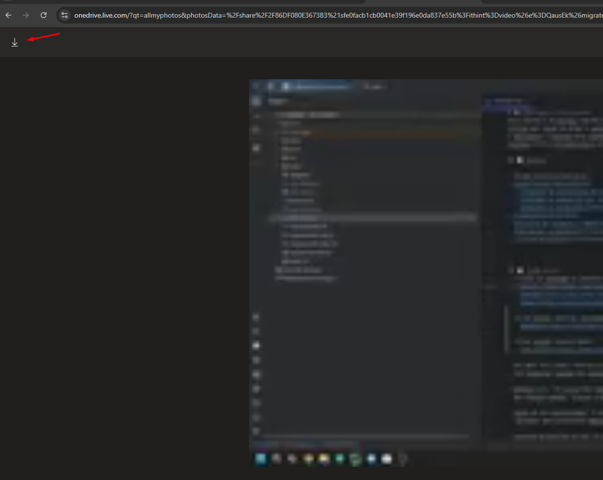

# 📚 challange-1-book-search
Book Search é um serviço FastAPI que expõe endpoints REST sob /api/v1 para consultar catálogos de livros, efetuar buscas, 
filtrar por faixa de preço e obter estatísticas agregadas sobre os títulos raspados do site público Books to Scrape. 
O aplicativo é montado pela classe AppBuilder, que registra os controladores de versão, constrói os casos de uso e injeta repositórios, 
clientes HTTP e infraestrutura de logging necessários para executar o domínio orientado a casos de uso.

## 📑 Sumário

- [Visão Geral](#visão-geral)
- [Arquitetura](#arquitetura)
  - [Diagrama de arquitetura do projeto](#diagrama-de-arquitetura-do-projeto)
  - [Diagrama de sequência das rotas e do script](#diagrama-de-sequência-das-rotas-e-do-script)
  - [Diagrama C4 do projeto](#diagrama-c4-do-projeto)
- [Endpoints](#endpoints)
- [Pipeline de scraping e dados](#pipeline-de-scraping-e-dados)
- [Reproduzir o ambiente](#-reproduzir-o-ambiente)
- [Futuras melhorias](#-futuras-melhorias)

---

## 🧭️ Visão Geral
- **Links de produção do projeto**: 
  - [Health Check](http://aws-cloud-challange-dev-alb-402052449.us-east-1.elb.amazonaws.com/api/v1/health)
  - [Swagger](http://aws-cloud-challange-dev-alb-402052449.us-east-1.elb.amazonaws.com/docs)
  - [Redoc](http://aws-cloud-challange-dev-alb-402052449.us-east-1.elb.amazonaws.com/redoc) <br><br>

- **Link vídeo de apresentação do projeto** <br><br>
  - [Link: Apresentação](https://1drv.ms/v/c/2f86df080e3673b3/EbGsD_4Ay-NBnxluDag35VsBIibzVvzaYFW1HdpFqVir7A?e=QausEk)
    - A visualização direta pelo link está com uma qualidade inferior, favor realizar a download da apresentação através:
    - 

- **Link acesso newrelic Instrumentação/Logs aplicação em produção**:
  - [Link: NewRelic](https://1drv.ms/t/c/2f86df080e3673b3/Edk3x9aLlkVLjxonTRV53B0BMj18vbXuYnOZ3fpSBQZm2w?e=8Ub7Ag)<br><br>

- **Link acesso console aws**:
  - [Link: Aws-Console](https://1drv.ms/t/c/2f86df080e3673b3/ESBt-uIm4JJCryCEKT-flEsBSTGzqA8px7Y8uFkDgv5Q3g?e=LgcbqX)<br><br>
   
- API REST full-stack: Controllers FastAPI versionados em /api/v1 atendem consultas de saúde, livros, categorias e estatísticas 
  com respostas tipadas por esquemas Pydantic. <br><br>

- Domínio rico: Os livros são representados por ScrapeBook (campos, identificadores, monetização) e agrupados em ScrapeBooks, 
  que oferece buscas, filtros e estatísticas de média de preço e distribuição de avaliações. <br><br>

- Casos de uso orquestrados: A UseCaseManagerImpl valida entradas, cria escopos de logging e encaminha exceções/erros de 
  validação para presenters padronizados, resultando em respostas consistentes em JSON. <br><br>

- Catálogo persistido em CSV: O repositório ScrapeBookRepositoryImpl carrega e grava src/data/books.csv, 
  mantendo cache em memória para respostas mais rápidas. <br><br>

- Scraping assíncrono reutilizável: O caso de uso ScrapeBooksUseCaseImpl emprega httpx, BeautifulSoup e fake-useragent 
  para percorrer todas as páginas, extrair atributos e persistir livros, podendo ser acionado tanto via script CLI quanto por pipelines de entrega. <br><br>

- Script pronto para automação: src/scripts/Main.py expõe uma corrotina de scraping executável com asyncio, 
  emitindo exceções amigáveis via presenter caso a coleta falhe. <br><br>

---

## 🏗️ Arquitetura
### Composição e orquestração
AppBuilder encapsula a composição de dependências (logger contextual, fábrica de clientes HTTP e repositório) e registra 
todos os casos de uso no UseCaseManagerImpl, que trata validações, escopos de log e propagação de erros antes de invocar 
cada caso de uso.

### Camada de domínio
Os modelos ScrapeBook e ScrapeBooks formam o núcleo de domínio: cada livro possui VOs fortes (Rating, Money, Upc) e um 
identificador incremental thread-safe, enquanto a coleção controla categorias, filtros, ranking por avaliação, estatísticas 
de preço e disponibilidade.

### Persistência
ScrapeBookRepositoryImpl lê e grava o catálogo em CSV, com cache global _CACHE para evitar reprocessamentos. 
Na ausência do arquivo, o repositório retorna uma coleção vazia pronta para ser abastecida pelo scraper.

### Web scraping
ScrapeBooksUseCaseImpl percorre as páginas de catálogo, normaliza ratings para inteiros, extrai metadados e cria objetos
de domínio. Falhas ao carregar páginas ou links específicos são reportadas ao presenter, evitando persistência parcial.

### Observabilidade
A configuração de logs é centralizada em SetupAppLogger, aplicando filtros para suprimir health checks, enquanto 
AppLoggerImpl mantém escopos hierárquicos com metadados adicionais para cada execução de caso de uso.

- ### Diagrama de arquitetura do projeto
  diagrama: `docs/diagrams/High-Level Architecture Diagram.mermaid`
  

- ### Diagrama de sequência das rotas e do script
  diagrama: `docs/diagrams/Sequencia Routes and Script Diagram.mermaid`
  

  A sequência evidencia o fluxo padrão dos controladores (delegação ao caso de uso, reuso do catálogo em cache) e o 
  pipeline de scraping que percorre o site, atualiza o CSV e reporta falhas via presenter específico

- ### Diagrama C4 do projeto
  diagrama: `docs/diagrams/Diagram C4 Context.mermaid`
  
  
  #### Notas de contexto
  * A aplicação FastAPI é construída por `AppBuilder`, que instancia os controladores HTTP e expõe o objeto `app` em `src/api/Main.py`. <br>
  * A coleta de dados depende do site externo Books to Scrape, consumido pela use case `ScrapeBooksUseCaseImpl` via HTTPX.<br><br> 

  diagrama: `docs/diagrams/Diagram C4 Containers.mermaid`
   

  diagrama: `docs/diagrams/Diagram C4 Components FastApi Backend.mermaid`
  

  diagrama: `docs/diagrams/Diagram C4 Components Scraping Worker.mermaid`
  

---

## Endpoints
Todas as rotas REST ficam sob o prefixo /api/v1 (configurado no roteador base).

| Método | Rota | Descrição | Parâmetros principais | Resposta |
| --- | --- | --- | --- | --- |
| GET | `/api/v1/health` | Health-check simples. | — | `{"result": true}` – `HealthCheckOutput`. |
| GET | `/api/v1/books` | Lista todos os livros carregados. | — | Lista de `BookOutput`. |
| GET | `/api/v1/books/search` | Busca por título e/ou categoria (case-insensitive). | Query `title` e/ou `category`. | Lista de `BookOutput`. Retorna todos se ambos vazios. |
| GET | `/api/v1/books/top-rated` | Top 10 livros com maior nota. | — | Lista de `BookOutput` ordenada por rating. |
| GET | `/api/v1/books/price-range` | Filtra livros por faixa de preço. | Query obrigatória `min_price` e `max_price` (Decimal). | Lista de `BookOutput` crescente por preço. Valida que `min_price ≤ max_price`. |
| GET | `/api/v1/books/{book_id}` | Retorna detalhes de um livro. | Path `book_id` (inteiro >= 0). | `BookOutput` ou `{}` (404). |
| GET | `/api/v1/categories` | Lista todas as categorias conhecidas. | — | Lista de strings (categoria). |
| GET | `/api/v1/stats/overview` | Estatísticas gerais (contagem, ticket médio, distribuição de rating). | — | Objeto `BookStatsOutput`. |
| GET | `/api/v1/stats/categories` | Estatísticas por categoria. | — | Dict `{categoria: BookStatsOutput}`. |

---

## Pipeline de scraping e dados
O script `poetry run python -m src.scripts.Main` aciona o caso de uso de scraping via `AppBuilder`, que instancia o client HTTP (`httpx`), coleta todas as páginas do catálogo, monta objetos `ScrapeBook` e, ao final, salva o resultado no CSV cacheado dentro de `src/data/books.csv`. O repositório reaproveita um cache em memória para servir leituras subsequentes com baixo custo.

###  Como reproduzir localmente o scraping
1. **Requisitos** – Python 3.12+ e Poetry são necessários, conforme declarado em `pyproject.toml` (inclui dependências FastAPI, BeautifulSoup, httpx, fake-useragent, etc.).
2. **Instalação** – Execute `poetry install` para resolver dependências e o grupo de desenvolvimento definido no arquivo de projeto.
3. **Popular os dados** – Rode `poetry run python -m src.scripts.Main` para baixar e persistir o catálogo no CSV local antes de subir a API (opcional, caso já exista `books.csv`).
4. **Subir a API** – Inicie o servidor com `poetry run uvicorn src.api.Main:app --reload`. O aplicativo expõe OpenAPI em `/openapi.json`, Swagger UI em `/docs` e Redoc em `/redoc`.

---

## 🔁 Reproduzir o ambiente
Este projeto foi estruturado para rodar localmente e em um ambiente produtivo (nuvem) por meio de um pipeline automatizado 
orquestrado pelo script.sh. A lógica é tradicional — build, testes, empacotamento, deploy — mas com um toque 
moderno: um único ponto de entrada com alvos explícitos para CI/CD.

>   Convenção: todos os comandos abaixo assumem Linux/WSL/macOS. <br>
    No Windows puro, rode via WSL. <br>

### 🖥️ Execução local
- **Pré-requisitos**: 
  - Python 3.12+ 
  - Poetry.
- **Instalação de dependências**:
  ```bash
  poetry install
  ```
- **Comandos principais do `script.sh`**:
  - `./script.sh ci:build` – executa `poe fmt`, `poe lint` e `poe typecheck` em sequência.
  - `./script.sh ci:audit` – roda a auditoria configurada em `poe audit`.
  - `./script.sh ci:test:unit` – dispara os testes unitários (`poe test_unit`).
  - `./script.sh ci:test:integration` – executa os testes de integração (`poe test_integration`).
  - `./script.sh ci:test:e2e` – roda os testes end-to-end (`poe test_e2e`).
  - `./script.sh ci:all` – limpa o ambiente, sincroniza dependências e executa audit, build e testes (unit e integration) em sequência.
- **Popular o catálogo local**:
  ```bash
  poetry run python -m src.scripts.Main
  ```
- **Executar a API**:
  ```bash
  poetry run uvicorn src.api.Main:app --reload
  ```

### ☁️ Execução em ambiente “produtivo”
- **Pré-requisitos**: 
  - Python 3.12+
  - Poetry
  - Docker
  - Terraform
  - AWS CLI
  - New Relic CLI/Agent configurável. <br><br>
  
- **Configuração de segredos**:
  1. Criar o arquivo `infra/terraform/aws/.aws_credentials` com as credenciais do usuário (`aws_access_key_id=...` e `aws_secret_access_key=...`).
  2. Criar o arquivo `newrelic.ini` na raiz do projeto (pode ser baseado em `sample.newrelic.ini`) com as chaves da conta New Relic. <br><br>
  
- **Provisionar infraestrutura** (VPC, ECR, ECS, Tasks etc.) utilizando o `script.sh`:
  ```bash
  ./script.sh infra:init
  ./script.sh infra:plan
  ./script.sh infra:apply
  ```
- **Pipeline de qualidade e build**:
  ```bash
  ./script.sh ci:audit
  ./script.sh ci:build
  ./script.sh ci:test:unit
  ./script.sh ci:test:integration
  ./script.sh ci:test:e2e
  ```
- **Ciclo de CD**:
  1. `./script.sh cd:build execute_scrape` – realiza o build da imagem Docker e executa o scraping antes do empacotamento.
  2. `./script.sh cd:push` – realiza login no ECR (criando o repositório se necessário) e publica a imagem com a tag calculada.
  3. `./script.sh cd:deploy` – atualiza o serviço ECS apontando para a nova Task Definition e aguarda a estabilização.
  4. (Opcional) `./script.sh utils:logs_ecs_events` para inspecionar os últimos eventos do serviço.

Com essa rotina, o projeto pode ser construído, testado e publicado em ambiente produtivo utilizando os mesmos artefatos 
gerados localmente. <br>

**Verificações pós-deploy**: <br>
- Health: acesse o endpoint /api/v1/health do ALB público.
- Observabilidade:
  - Verifique o serviço no New Relic APM com o nome configurado (NEW_RELIC_APP_NAME).
  - Consulte logs e métricas de container/APP (NR Logs e NR Metrics/Infra).

---

## 🔮 Futuras melhorias
- **Autenticação e autorização**: implementar fluxo de login com emissão de tokens JWT para proteger rotas sensíveis, 
  permitindo papéis distintos (admin, leitor) e expiração/refresh automatizados.
- **Endpoints de machine learning**: disponibilizar as rotas de ML previstas no escopo original, integrando modelos de 
  recomendação ou classificação para enriquecer a experiência de busca.
- **Pipeline de CI/CD gerenciado**: migrar o `script.sh` para uma ferramenta como GitHub Actions ou GitLab CI, 
  garantindo execução automática dos jobs de qualidade, build e deploy a cada push em branches principais.
- **DNS amigável**: provisionar um domínio gerenciado via Route53 apontando para o Load Balancer, com certificados TLS 
  válidos (ACM) e redirecionamento HTTPS forçado.
- **Observabilidade e custo**: configurar alertas proativos (CloudWatch, New Relic) para erro/latência e revisar políticas 
  de autoscaling para evitar sobrecusto e melhorar resiliência.

---